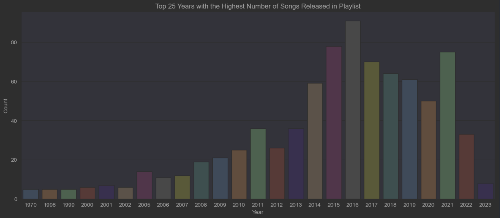
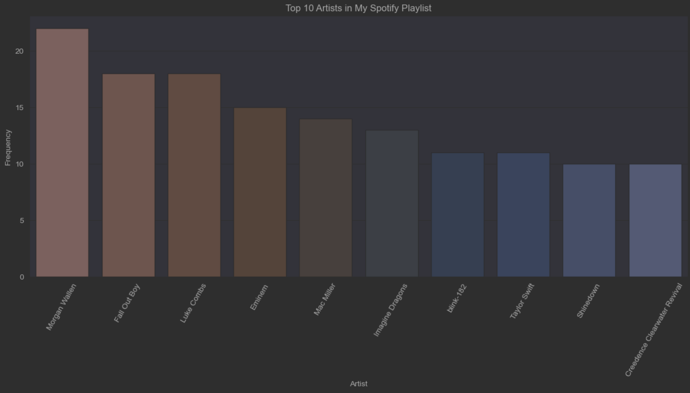
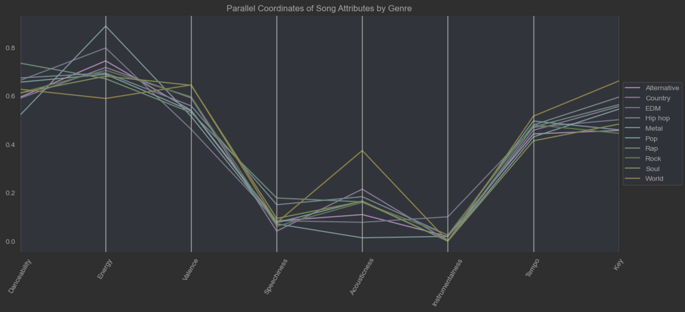
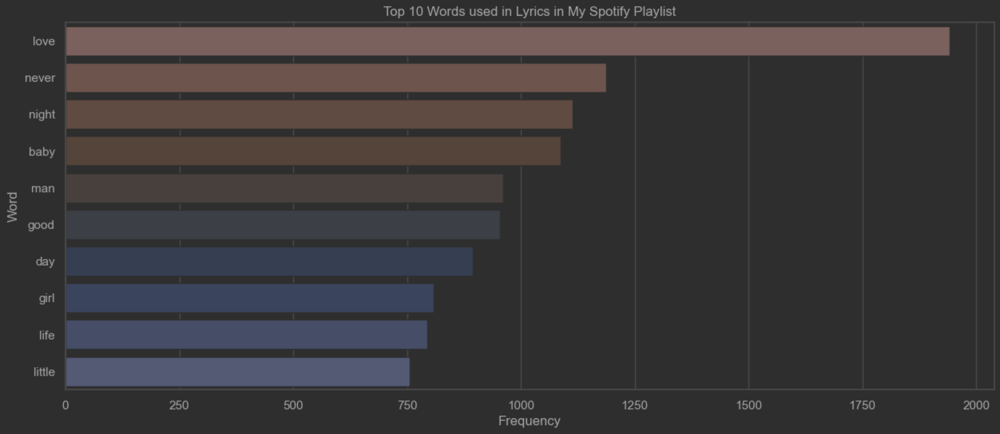
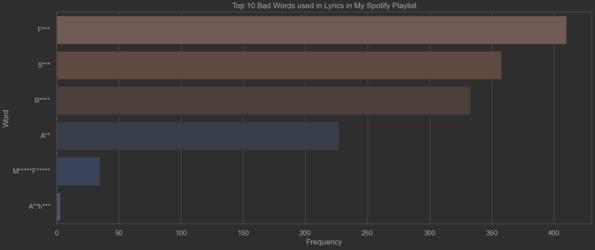
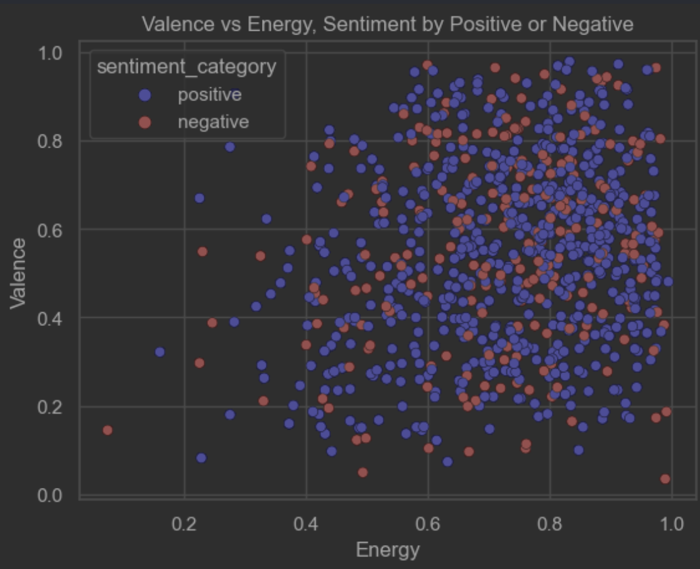
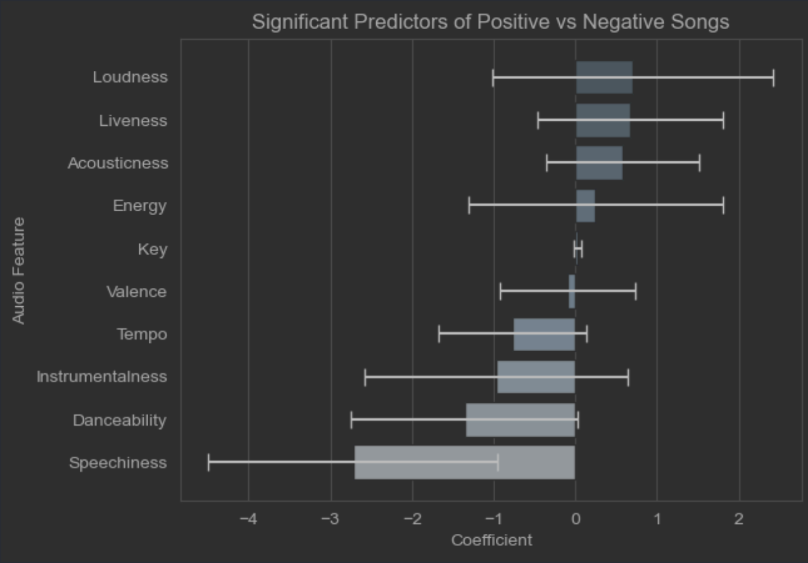

# Spotify API - Final Project
### By: Matthew Elms

This project was completed using the packages:
1. OS
2. Spotipy
3. dotenv
4. lyricsgenius
5. NLTK
6. Counter
7. Concurrent.futures


As well as the following packages:

``` python
import pandas as pd
import matplotlib.pyplot as plt
import seaborn as sns
from pandas.plotting import parallel_coordinates
import re
from textblob import TextBlob
from textblob.sentiments import NaiveBayesAnalyzer
import statsmodels.api as sm
```

``` python
datafile = "/Users/mattelms/Documents/School/R-Intro-Data-Science/Spotify_Program/PySpotify/everything_playlist.csv"
df = pd.read_csv(datafile)
```

``` python
df_clean = pd.DataFrame(df)
df_clean = df_clean.drop(columns=['Duration_ms', 'Mode'])
df_clean
```


# MAJOR BATHING OF DATA AHEAD

### Cleaned tempo and loudness data to be on the same scale as the rest of the attributes (0-1.0)

``` python
# Min - Max for tempo
min_tempo = df_clean['Tempo'].min()
max_tempo = df_clean['Tempo'].max()

# Scale the values in tempo to range from 0 to 1
df_clean['Tempo'] = (df_clean['Tempo'] - min_tempo) / (max_tempo - min_tempo)

# Min - Max for loudness
min_loudness = df_clean['Loudness'].min()
max_loudness = df_clean['Loudness'].max()

# Scale the values in loudness to range from 0 to 1
df_clean['Loudness'] = (df_clean['Loudness'] - min_loudness) / (max_loudness - min_loudness)
```

### Change Release Date to an actual date


``` python
# Convert 'Release Date' to an actual date
df_clean['Release_Date'] = pd.to_datetime(df_clean['Release_Date'])
df_clean
```


### Remove Duplicated songs in the playlist if there are any


``` python
df_clean = df_clean.drop_duplicates(subset=['Song', 'Artist'], keep='first')
df_clean = df_clean.sort_values('Song').reset_index(drop=True)
```


###### 6 songs were dropped as duplicates!


``` python
df_clean.shape
```


### Cleaned the Genres column to have only the first genre of the "list"


``` python
df_clean['Genres'] = df_clean['Genres'].replace(to_replace=r"[\[\]']", value='', regex=True)
df_clean['Genre'] = df_clean['Genres'].str.split(',').str[0]
df_clean = df_clean.drop('Genres', axis=1)
df_clean
df_clean = df_clean[
    ['Song', 'Artist', 'Genre', 'Album', 'Release_Date', 'Popularity', 'Danceability', 'Energy', 'Key', 'Loudness',
     'Speechiness', 'Acousticness', 'Instrumentalness', 'Liveness', 'Valence', 'Tempo']]
df_clean
```

### The Genres were very... vast; meaning the genres used very specific sub-genres rather than common genre categories. This code fixes this problem.

##### ChatGPT was used to turn this process into a 5 minute task. By printing all the unique genres, I was able to tell ChatGPT to turn that list into a consolidated genres; Country, Rock, Rap, Pop, Metal, etc.


``` python
# ChatGPT gets an award for this... JESUS
genre_map = {
    'classic texas country': 'Country',
    'contemporary country': 'Country',
    'country pop': 'Country',
    'classic oklahoma country': 'Country',
    'australian country': 'Country',
    'country': 'Country',
    'country rock': 'Country',
    'classic country pop': 'Country',
    'arkansas country': 'Country',
    'modern southern rock': 'Country',
    'country rap': 'Country',
    'redneck': 'Country',
    'modern country pop': 'Country',

    'big room': 'EDM',
    'edm': 'EDM',
    'brostep': 'EDM',
    'complextro': 'EDM',
    'dutch house': 'EDM',
    'europop': 'EDM',
    'dancefloor dnb': 'EDM',
    'deep pop edm': 'EDM',
    'dutch edm': 'EDM',
    'australian dance': 'EDM',
    'classic hardstyle': 'EDM',
    'aussietronica': 'EDM',
    'filter house': 'EDM',
    'danish electronic': 'EDM',
    'canadian electronic': 'EDM',
    'viral trap': 'EDM',
    'downtempo': 'EDM',
    'uk dance': 'EDM',
    'tropical house': 'EDM',
    'future funk': 'EDM',

    'alternative dance': 'Alternative',
    'modern indie pop': 'Alternative',
    'indie pop rap': 'Alternative',
    'pov: indie': 'Alternative',
    'indie rock italiano': 'Alternative',
    'indietronica': 'Alternative',
    'alternative rock': 'Alternative',
    'modern alternative rock': 'Alternative',
    'british alternative rock': 'Alternative',
    'alternative hip hop': 'Alternative',
    'neon pop punk': 'Alternative',
    'modern alternative pop': 'Alternative',
    'hopebeat': 'Alternative',
    'alt z': 'Alternative',
    'shimmer psych': 'Alternative',
    'indie poptimism': 'Alternative',
    'indie pop': 'Alternative',
    'pixie': 'Alternative',
    'french shoegaze': 'Alternative',
    'icelandic indie': 'Alternative',
    'canadian indie': 'Alternative',
    'escape room': 'Alternative',
    'indie rock': 'Alternative',
    'emo': 'Alternative',
    'brooklyn indie': 'Alternative',
    'bath indie': 'Alternative',

    'pop': 'Pop',
    'dance pop': 'Pop',
    'danish pop': 'Pop',
    'adult standards': 'Pop',
    'lilith': 'Pop',
    'folk-pop': 'Pop',
    'candy pop': 'Pop',
    'social media pop': 'Pop',
    'pop rock': 'Pop',
    'new romantic': 'Pop',
    'la pop': 'Pop',
    'australian pop': 'Pop',
    'pop dance': 'Pop',
    'pop punk': 'Pop',
    'post-teen pop': 'Pop',
    'viral pop': 'Pop',
    'pop rap': 'Pop',
    'art pop': 'Pop',
    'gauze pop': 'Pop',
    'canadian pop': 'Pop',
    'bubblegum pop': 'Pop',
    'girl group': 'Pop',
    'electropop': 'Pop',
    'neo mellow': 'Pop',
    'bossbeat': 'Pop',
    'ccm': 'Pop',
    'boy band': 'Pop',
    'swedish pop': 'Pop',
    'baroque pop': 'Pop',
    'karaoke': 'Pop',
    'german pop': 'Pop',
    'chamber pop': 'Pop',
    'scandipop': 'Pop',
    'canadian contemporary r&b': 'Pop',
    'acoustic pop': 'Pop',
    'disco': 'Pop',
    'bedroom pop': 'Pop',

    'alternative metal': 'Metal',
    'nu metal': 'Metal',
    'metalcore': 'Metal',
    'melodic metalcore': 'Metal',
    'american metalcore': 'Metal',
    'prog metal': 'Metal',
    'comic metal': 'Metal',

    'rock': 'Rock',
    'piano rock': 'Rock',
    'modern rock': 'Rock',
    'classic rock': 'Rock',
    'dance rock': 'Rock',
    'album rock': 'Rock',
    'garage rock': 'Rock',
    'blues rock': 'Rock',
    'modern folk rock': 'Rock',
    'celtic rock': 'Rock',
    'classic canadian rock': 'Rock',
    'permanent wave': 'Rock',
    'kentucky indie': 'Rock',
    'modern blues rock': 'Rock',
    'deathgrass': 'Rock',
    'canadian punk': 'Rock',
    'beatlesque': 'Rock',

    'world': 'World',
    'flamenco': 'World',
    'shanty': 'World',
    'mariachi': 'World',
    'reggae cover': 'World',
    'reggaeton': 'World',
    'movie tunes': 'World',
    'orchestral soundtrack': 'World',
    'latin pop': 'World',
    'black americana': 'World',

    'hip hop': 'Hip hop',
    'australian hip hop': 'Hip hop',
    'atl hip hop': 'Hip hop',
    'ohio hip hop': 'Hip hop',
    'pittsburgh indie': 'Hip hop',
    'miami hip hop': 'Hip hop',
    'east coast hip hop': 'Hip hop',
    'la indie': 'Hip hop',
    'lgbtq+ hip hop': 'Hip hop',
    'alberta country': 'Hip hop',
    'canadian hip hop': 'Hip hop',
    'uk contemporary r&b': 'Hip hop',
    'memphis soul': 'Hip hop',

    'rap': 'Rap',
    'trap': 'Rap',
    'cali rap': 'Rap',
    'chicago rap': 'Rap',
    'new jersey rap': 'Rap',
    'dfw rap': 'Rap',
    'brooklyn drill': 'Rap',
    'conscious hip hop': 'Rap',
    'detroit hip hop': 'Rap',
    'chicago house': 'Rap',
    'sad rap': 'Rap',
    'metropopolis': 'Rap',
    'gen z singer-songwriter': 'Rap',
    'rap rock': 'Rap',
    'deep underground hip hop': 'Rap',
    'viral rap': 'Rap',
    'meme rap': 'Rap',
    'dirty south rap': 'Rap',
    'comedy rap': 'Rap',
    'maga rap': 'Rap',
    'double drumming': 'Rap',
    'banjo': 'Rap',
    'melodic rap': 'Rap',

    'soul': 'Soul',
    'neo soul': 'Soul',
    'classic soul': 'Soul',
    'british soul': 'Soul',
    'r&b': 'Soul',
    'bedroom soul': 'Soul'
}
df_clean['Genre'] = df_clean['Genre'].replace(genre_map)
print(df_clean['Genre'].unique())
df_clean
```

#### The Spotify API is not perfect and not every song has a genre, therefore, I needed to manually clean the data.


``` python
# Manual Cleaning :( No AI help on this one guys
df_clean.loc[df_clean['Artist'] == 'Connor Price', 'Genre'] = 'Rap'
df_clean.loc[df_clean['Artist'] == 'Kyndal Inskeep', 'Genre'] = 'Country'
df_clean.loc[df_clean['Artist'] == '1 Hour Band', 'Genre'] = 'Pop'
df_clean.loc[df_clean['Artist'] == 'Alice Merton', 'Genre'] = 'Pop'
df_clean.loc[df_clean['Artist'] == 'Mashd N Kutcher', 'Genre'] = 'EDM'
df_clean.loc[df_clean['Artist'] == 'L.B. One', 'Genre'] = 'Rock'
df_clean.loc[df_clean['Artist'] == 'Wes Walker', 'Genre'] = 'Rap'
df_clean.loc[df_clean['Artist'] == 'Nic D', 'Genre'] = 'Pop'
df_clean.loc[df_clean['Artist'] == 'Nicky Youre', 'Genre'] = 'Pop'
df_clean.loc[df_clean['Artist'] == 'Everlast', 'Genre'] = 'Hip hop'
df_clean.loc[df_clean['Artist'] == 'Nico & Vinz', 'Genre'] = 'Pop'
df_clean.loc[df_clean['Artist'] == 'NEFFEX', 'Genre'] = 'Metal'
df_clean.loc[df_clean['Artist'] == 'Superstar Pride', 'Genre'] = 'Rap'
df_clean.loc[df_clean['Artist'] == 'ROSE BEAT', 'Genre'] = 'EDM'
df_clean.loc[df_clean['Artist'] == 'Drake White', 'Genre'] = 'Country'
df_clean.loc[df_clean['Artist'] == 'Justice Moses', 'Genre'] = 'Hip hop'
df_clean.loc[df_clean['Artist'] == 'Lakeview', 'Genre'] = 'Country'
df_clean.loc[df_clean['Artist'] == 'HIIT BPM', 'Genre'] = 'Country'
df_clean.loc[df_clean['Artist'] == 'PLVTINUM', 'Genre'] = 'Rap'
df_clean.loc[df_clean['Artist'] == 'Redfoo', 'Genre'] = 'EDM'
df_clean.loc[df_clean['Artist'] == 'Brooks Jefferson', 'Genre'] = 'Country'
df_clean.loc[df_clean['Artist'] == 'Two Friends', 'Genre'] = 'EDM'
df_clean.loc[df_clean['Artist'] == 'Niko Moon', 'Genre'] = 'Country'
df_clean.loc[df_clean['Artist'] == 'Caleb Mills', 'Genre'] = 'Country'
df_clean.loc[df_clean['Artist'] == 'Mark Ronson', 'Genre'] = 'Pop'
df_clean.loc[df_clean['Artist'] == 'John Harvie', 'Genre'] = 'Rock'
df_clean.loc[df_clean['Artist'] == 'Tangerine Kitty', 'Genre'] = 'Pop'
df_clean.loc[df_clean['Artist'] == 'Social House', 'Genre'] = 'Hip hop'
df_clean.loc[df_clean['Artist'] == 'TWISTED', 'Genre'] = 'EDM'
df_clean.loc[df_clean['Artist'] == 'ScurtDae', 'Genre'] = 'Hip hop'
df_clean.loc[df_clean['Song'] == 'Led', 'Genre'] = 'Rap'
df_clean
```

## This is the cleaned Dataset ready to be analyzed


``` python
df_clean
```
##### Output:
<div class="output execute_result" execution_count="11">

                                         Song               Artist        Genre  \
    0                          'Til You Can't         Cody Johnson      Country   
    1                               1, 2 Many           Luke Combs      Country   
    2                           100 Grandkids           Mac Miller      Hip hop   
    3                                   10:35               Tiësto          EDM   
    4                                    1901              Phoenix  Alternative   
    ..                                    ...                  ...          ...   
    870  my ex's best friend (with blackbear)    Machine Gun Kelly      Hip hop   
    871                            ocean eyes        Billie Eilish          Pop   
    872                                 oops!           Yung Gravy          Rap   
    873                                   oui              Jeremih          Rap   
    874   overwhelmed - Chri$tian Gate$ remix  Royal & the Serpent  Alternative   

                                Album Release_Date  Popularity  Danceability  \
    0          Human The Double Album   2021-10-08          75         0.501   
    1    What You See Is What You Get   2019-11-08          73         0.540   
    2                        GO:OD AM   2015-09-18          65         0.735   
    3                           10:35   2022-11-03          89         0.696   
    4        Wolfgang Amadeus Phoenix   2009-05-25           6         0.591   
    ..                            ...          ...         ...           ...   
    870        Tickets To My Downfall   2020-09-25          77         0.731   
    871             Summer Heartbreak   2021-08-13           0         0.358   
    872                      Gasanova   2020-10-02          69         0.886   
    873        Late Nights: The Album   2015-12-04          77         0.418   
    874     overwhelmed (the remixes)   2021-02-05          67         0.619   

         Energy  Key  Loudness  Speechiness  Acousticness  Instrumentalness  \
    0     0.815    1  0.749489       0.0436       0.05130          0.000000   
    1     0.821    6  0.810556       0.0873       0.03970          0.000000   
    2     0.749   10  0.811862       0.0874       0.37100          0.000000   
    3     0.793    8  0.700227       0.0970       0.06830          0.000004   
    4     0.831    0  0.705108       0.0415       0.06050          0.000047   
    ..      ...  ...       ...          ...           ...               ...   
    870   0.675    5  0.734222       0.0434       0.00473          0.000000   
    871   0.372    4  0.590636       0.0464       0.81000          0.053900   
    872   0.743    6  0.639841       0.0812       0.03580          0.000198   
    873   0.724    5  0.814245       0.0964       0.21300          0.000000   
    874   0.502    0  0.566061       0.2490       0.17800          0.000000   

         Liveness  Valence     Tempo  
    0      0.1060    0.460  0.695044  
    1      0.4230    0.685  0.624590  
    2      0.4700    0.373  0.280841  
    3      0.1800    0.698  0.444883  
    4      0.1900    0.705  0.595171  
    ..        ...      ...       ...  
    870    0.1410    0.298  0.475689  
    871    0.0877    0.160  0.599845  
    872    0.0511    0.941  0.519144  
    873    0.1120    0.604  0.185998  
    874    0.1550    0.380  0.783097  

    [875 rows x 16 columns]


### Question: Percentage of Genres in the Playlist

##### Genre Breakdown for entire playlist

###### Code:
``` python
genre_counts = df_clean['Genre'].value_counts()

fig, ax = plt.subplots(figsize=(10, 8))


def autopct_format(pct):
    return f'{pct:.1f}%' if pct > 0 else ''


wedges, texts, autotexts = ax.pie(
    genre_counts,
    labels=genre_counts.index,
    autopct=autopct_format,
    startangle=180,
    pctdistance=0.75
)

ax.axis('equal')
plt.setp(texts, fontsize=12)
plt.setp(autotexts, fontsize=10)
centre_circle = plt.Circle((0, 0), 0.25, fc='white')
fig.gca().add_artist(centre_circle)
plt.legend(title="Genres", loc="center left", bbox_to_anchor=(1, 0, 0.5, 1))
plt.title("Percentage of Songs in Each Genre")

# Display the chart
plt.show()
```


### Question: Top 25 Years with the Highest Number of Songs Released in Playlist

#### Song Release year breakdown for entire playlist

###### Code:

``` python
# Extract the year from the 'Date' column and create a new 'Year' column
year = df_clean['Release_Date'].dt.year

# Group the dataframe by 'Year' and count the instances
year_counts = year.value_counts().reset_index()
year_counts.columns = ['Year', 'Count']
year_counts = year_counts.sort_values(by='Count', ascending=False)
# Select the top 25 years
top_25_years = year_counts.head(25)

# Create a bar graph using Seaborn
plt.figure(figsize=(15, 6))
sns.barplot(x='Year', y='Count', data=top_25_years, palette='pastel')
plt.title('Top 25 Years with the Highest Number of Songs Released in Playlist')
plt.xlabel('Year')
plt.ylabel('Count')

plt.show()
```





This graph shows my top 25 years with the highest number of songs
released in the playlist. My most common years were between 2014-2021!


### Question: Top 10 Artists with the Highest Number of Songs in the Playlist

#### Artist breakdown for entire playlist

###### Code:

``` python
top_artists = df_clean['Artist'].value_counts().head(10)

top_artists_df = top_artists.reset_index()
top_artists_df.columns = ['artist', 'frequency']

# Create a color map
colors = sns.color_palette("coolwarm_r", n_colors=len(top_artists))

# Create the bar chart
plt.figure(figsize=(15, 6))
sns.barplot(x='artist', y='frequency', data=top_artists_df, palette=colors)
plt.title('Top 10 Artists in My Spotify Playlist')
plt.xlabel('Artist')
plt.ylabel('Frequency')
plt.xticks(rotation=60)
plt.show()
```





This graph shows my top 10 artists in my Spotify playlist. It also shows
how diverse my musical taste is and it shows that I don't like an artist
just because they are an artist. Morgan Wallen has over 100 songs, but I
only liked roughly a quarter of his songs.


### Question: Determine how genres effect different attributes in the Spotify Playlist

#### Graph to show the average of song attributes by genre

###### Code:

``` python
grouped_by_genre = df_clean.groupby('Genre')
attributes = ['Danceability', 'Energy', 'Valence', 'Speechiness', 'Acousticness', 'Instrumentalness', 'Tempo', 'Key']
mean_by_genre = grouped_by_genre[attributes].mean()

# Create a new DataFrame with the mean values of the song attributes and genre labels
selected_data = mean_by_genre.reset_index()

selected_data['Key'] = selected_data['Key'] / 10

# Create the parallel coordinates plot
plt.figure(figsize=(15, 6))
ax = parallel_coordinates(selected_data, 'Genre', colormap='viridis')

# Set the legend location
ax.legend(loc='center left', bbox_to_anchor=(1, 0.5))

plt.title('Parallel Coordinates of Song Attributes by Genre')
plt.xticks(rotation=60)
plt.show()
```





This graph groups all the songs by genres and analyzes the averages for
each attribute. This not only shows the different genres and how they
might be different because of the attributes but also shows general
trend of my music as a whole!


## Using another python script, get_lyrics.py, I was able to create two CSVs one with lyrics and one with word counts.


``` python
datafile = "/Users/mattelms/Documents/School/R-Intro-Data-Science/Spotify_Program/PySpotify/word_counts.csv"
df_lyricsCount = pd.read_csv(datafile)
df_lyricsCountTest = df_lyricsCount
```


#### Question: Using NLP to get the top 10 Words used in Lyrics in My Spotify Playlist

###### Code:

``` python
# Create a color map with green and blue colors
colors = sns.color_palette("coolwarm_r", n_colors=10)

# Create the bar chart
plt.figure(figsize=(15, 6))
sns.barplot(y='word', x='count', data=df_lyricsCount.head(10), palette=colors)
plt.title('Top 10 Words used in Lyrics in My Spotify Playlist')
plt.ylabel('Word')
plt.xlabel('Frequency')
plt.show()
```





This graph depicts the top ten words used in lyrics in my Spotify
playlist. I find it an interesting way to use NLP to discover the type
of music I listen to.


# Disclaimer:

#### This is to explore Natural Language Processing, I feel as 'Bad' words are part of natural language, they should be processed as well. Artists add 'bad' words to music to convey how they truly feel. My time in the service was littered with the use of foul language, however, it was natural and ingrained in us. I felt it would be an interesting perspective to look at all my favorite musics lyrics, but I would be doing an injustice to not analyze what might be the most important, thought-provoking words artists use in their music and why I listen to them. I will censor any foul words as this IS a school project.


``` python
bad = [***Censored***]

mask = df_lyricsCount['word'].isin(bad).copy()

df_badWords = df_lyricsCount.loc[mask]
```

``` python
# Remove common suffix from bad words
def remove_suffix(word):
    # remove 'ing' suffix
    word = re.sub(r'ing$', '', word)
    # remove 'es' suffix
    word = re.sub(r'es', '', word)
    # remove ' ' suffix
    word = re.sub(r' ', '', word)
    # remove 'rs' suffix
    word = re.sub(r'rs', 'r', word)
    # remove 'ks' suffix
    word = re.sub(r'ks', 'k', word)
    return word

# apply function to word column
df_badWords.loc[:, 'word'] = df_badWords['word'].apply(remove_suffix)
df_sum = df_badWords.groupby('word').agg({'count': 'sum'})
# sort by count
df_sum = df_sum.sort_values('count', ascending=False).reset_index()
```

#### Question: Question: Using NLP to get the top 10 'Bad' Words used in Lyrics in My Spotify Playlist

###### Code:

``` python
# Change labels
labels = ['F***', 'S***', 'B****', 'A**', 'M*****F*****', 'A**h***']

# Create the bar chart
plt.figure(figsize=(15, 6))
ax = sns.barplot(y='word', x='count', data=df_sum, palette="coolwarm_r")
ax.set_yticklabels(labels)
plt.title('Top 10 Bad Words used in Lyrics in My Spotify Playlist')
plt.ylabel('Word')
plt.xlabel('Frequency')
plt.show()
```





This graph depicts the top ten bad words used in lyrics in my Spotify
playlist. Censored obviously.

#### This cell will be commented out because it takes a long time to run. But it creates another CSV to process for Sentiment Analysis.


``` python
"""
datafile = "/Users/mattelms/Documents/School/R-Intro-Data-Science/Spotify_Program/PySpotify/everything_lyrics.csv"
df_lyrics = pd.read_csv(datafile)
df_lyrics['sentiment'] = 0.0

# Analyze sentiment for each song
for i, row in df_lyrics.iterrows():
    lyrics = row['Lyrics']
    blob = TextBlob(lyrics, analyzer=NaiveBayesAnalyzer())
    sentiment = blob.sentiment.p_pos - blob.sentiment.p_neg
    df_lyrics.at[i, 'sentiment'] = sentiment

# Classify songs as positive or negative based on sentiment score
df_lyrics['sentiment_category'] = df_lyrics['sentiment'].apply(lambda x: 'positive' if x > 0 else 'negative')

# Print the first 10 songs and their sentiment categories
df_sent = df_lyrics[['Song', 'Artist', 'sentiment_category']]
df_sent.to_csv("sentiment.csv")
"""
```


#### This is the import of the CSV so I do not need to keep running the above cell.


``` python
datafile = "/Users/mattelms/Documents/School/R-Intro-Data-Science/Spotify_Program/PySpotify/sentiments.csv"
df_sent1 = pd.read_csv(datafile)
df_sent1
```

                   Song         Artist sentiment_category
    0     100 Grandkids     Mac Miller           positive
    1             10:35         Tiësto           positive
    2         1, 2 Many     Luke Combs           positive
    3              1901        Phoenix           positive
    4              2055  Sleepy Hallow           positive
    ..              ...            ...                ...
    858        Daylight  David Kushner           positive
    859          Violet   Connor Price           positive
    860         Spinnin   Connor Price           negative
    861           Buddy   Connor Price           positive
    862  Jordan Belfort     Wes Walker           negative

    [863 rows x 3 columns]


``` python
attSentiments = pd.merge(df_sent1, df_clean, on=['Song','Artist'])
attSentiments
```

#### Question: Using NLP and the spotify song attributes, "Valence and Energy", determine if their is a correlation between song lyric sentiment and song attributes described as determining if a songs beat is positive or negative.

###### Code:

``` python
# Create a scatterplot with Sentiment variable determining color
sns.scatterplot(x='Energy', y='Valence', hue='sentiment_category', data=attSentiments, palette=['blue', 'red'])

# Add axis labels and title
plt.xlabel('Energy')
plt.ylabel('Valence')
plt.title('Valence vs Energy, Sentiment by Positive or Negative')

plt.show()
```





Valence and Energy are the most common attributes according to the
Spotify API that define how positive (good feeling) or negative (bad
feeling) the song is. I wanted to compare the valence and energy of
positive and negative songs according to the NB analyzer. However, I am
not sure if there was a correlation between them. I'm glad there was not
a correlation because valence and energy describe the beat and tone of
the song, whereas NLP is analyzing the lyrics of the song alone.


#### Question: Uing NLP, how do sentiments of the song lyrics correlate with song attributes?

###### Code:

``` python
correlation = attSentiments.loc[:, ['Danceability', 'Energy', 'Key', 'Loudness', 'Speechiness', 'Acousticness', 'Instrumentalness', 'Liveness', 'Valence', 'Tempo', 'sentiment_category']]
correlation['pos_neg'] = correlation['sentiment_category'].apply(lambda x: 1 if x == 'positive' else 0)

X = correlation.drop(['sentiment_category', 'pos_neg'], axis=1)
y = correlation['pos_neg']
X = sm.add_constant(X)

# Fit a logistic regression model
model = sm.Logit(y, X).fit()

# Get the coefficients and their confidence intervals
coef_df = model.params.to_frame('coef')
coef_df['lower'] = model.conf_int()[0]
coef_df['upper'] = model.conf_int()[1]

# Sort the coefficients
coef_df = coef_df.iloc[1:].sort_values('coef', ascending=False)

# Create a bar chart of the coefficients and their confidence intervals
sns.set_style('whitegrid')
sns.barplot(x='coef', y=coef_df.index, data=coef_df, palette='Blues_d')
plt.errorbar(x=coef_df['coef'], y=coef_df.index, xerr=[coef_df['coef'] - coef_df['lower'], coef_df['upper'] - coef_df['coef']], fmt='none', capsize=5, color='black')
plt.xlabel('Coefficient')
plt.ylabel('Audio Feature')
plt.title('Significant Predictors of Positive vs Negative Songs')
plt.show()
```




This graph depicts the significant predictors of positive and negative
songs according to the NB analyzer when correlated with the attributes
provided by Spotify. This shows loudness has a higher correlation to
Positive songs and speechiness has a higher correlation to Negative
songs.
